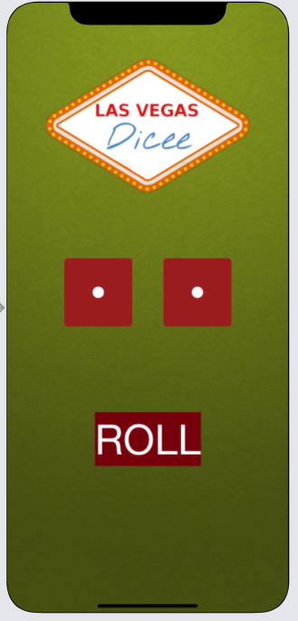

# Dice iOS App 

## Challenges I Faced?

I had difficulty understanding ways of implementing IBActions and IBOutlets, Also how to properly manipulate arrays is a foggy concept. 

## How Did I Over Come Those Challenges? 

Through collaboration with my peers we were able to discuss ways and means of completing the project. This exercise gave me a clear understanding on IBActions, IBOutlets and manipulating arrays. By leveraging platforms like Google, YouTube, MDN docs, Stackoverflow, GitHub, online courses, bootcamps and reference guides I was able to find the proper Swift methods and functions needed to complete the task and I programmed the Dice App accordingly.

## What I will learned

* How to clone an existing Xcode project from GitHub.
* How to create an app with behaviour and functionality.
* How to create links between the Interface Builder files and code using IBActions and IBOutlets.
* Became more familiar with the Xcode code editor.
* How to use comments to annotate code.
* How to understand and use Swift constants and variables.
* How to understand and use collection types such as Swift arrays.
* How to test and debug your app with the Xcode console.
* How to use randomisation and how to generate random numbers in Swift.

